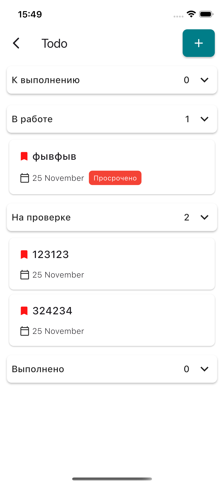

# 🚀 TodoTask PlayerTask

    

### 1. 📱 Демонстрация на iPhone (Портрет/Ландшафт)

[Видео 2](soruce/iPhone16.mp4)

### 2. 🖥️ Демонстрация на iPad (Планшетный вид)

Этот клип показывает, как плеер масштабируется на более крупном экране планшета (возможно, с другими
пропорциями UI-элементов).
[Видео 1](soruce/iPad.mp4)

1. Разрешить установку из неизвестных источников на Android.
2. Скачать APK и открыть для установки.
3. После установки приложение будет доступно на главном экране.
   [APK](soruce/app-release.apk)

---

## ⚙️ Технические детали

* **Исходные файлы видео:** `soruce/iPhone 16.mp4`, `soruce/iPad Air 13-inch (M3).mp4`
* **Использованные пакеты:** `video_player`, `flutter_bloc`
 